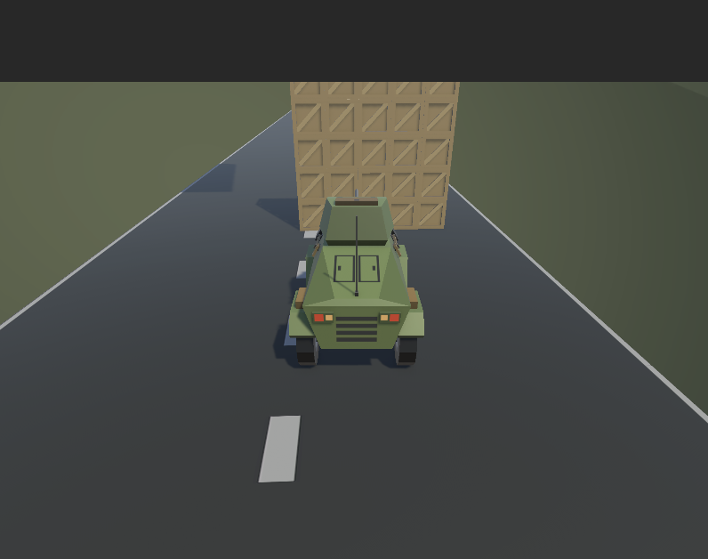
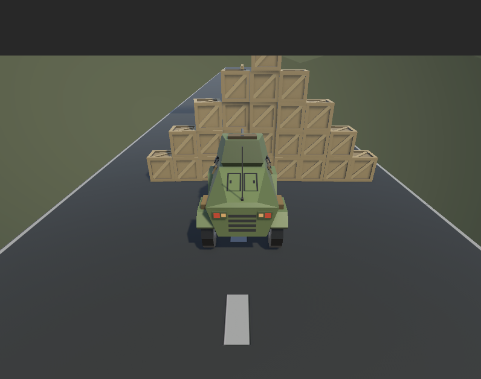

# Unity Procedural Spawner Demo

## Overview

This Unity project demonstrates different procedural object spawning techniques using C# scripts. The project focuses on generating box objects in structured and random patterns to explore procedural generation concepts in Unity.

The repository contains three main spawning systems:

* Box Spawner
* Pyramid Spawner
* Random Spawner

These scripts show different approaches to automatically generating objects in a scene.

## Scripts Included

* **Gridstacker.cs** – Spawns boxes in a structured grid pattern.
* **PyramidSpawner.cs** – Generates boxes in a pyramid-style stacked formation.
* **ProceduralBoxSpawner.cs** – Spawns boxes randomly within a defined area.

## Spawner Demonstrations

### Box Spawner

Demonstrates structured spawning of boxes using grid-based positioning.

### Pyramid Spawner

Creates a pyramid formation of stacked boxes by progressively reducing the number of objects per layer.

### Random Spawner

Shows procedural generation by spawning boxes at random positions.

Video demonstration:

## Purpose

This project was created to practice and demonstrate:

* Procedural generation in Unity
* Object instantiation using C#
* Grid-based spawning systems
* Randomized spawning logic

## How to Use

1. Download or clone the repository.
2. Open the project in Unity.
3. Add the spawner scripts to a GameObject in the scene.
4. Press **Play** to see the spawning systems in action.

## Author

Created as part of learning Unity game development and procedural content generation.
